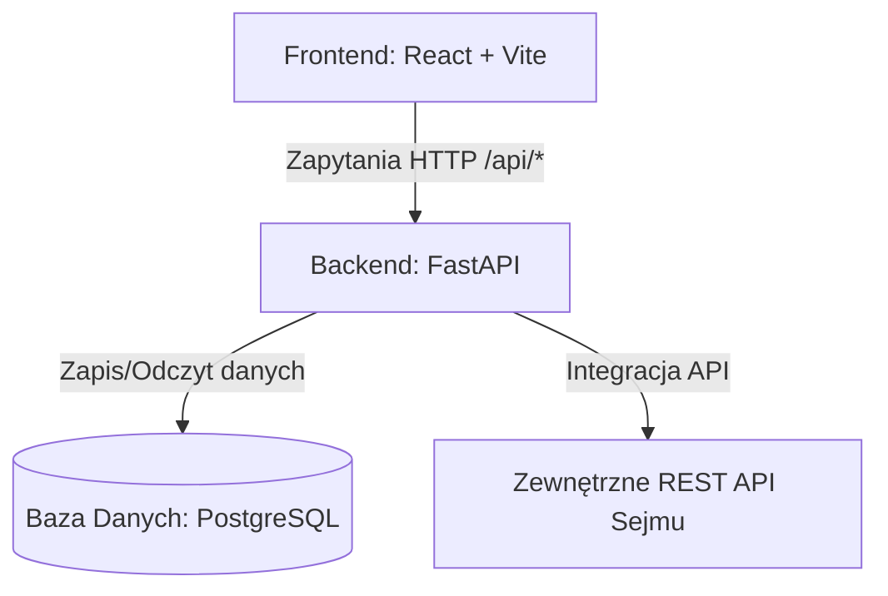
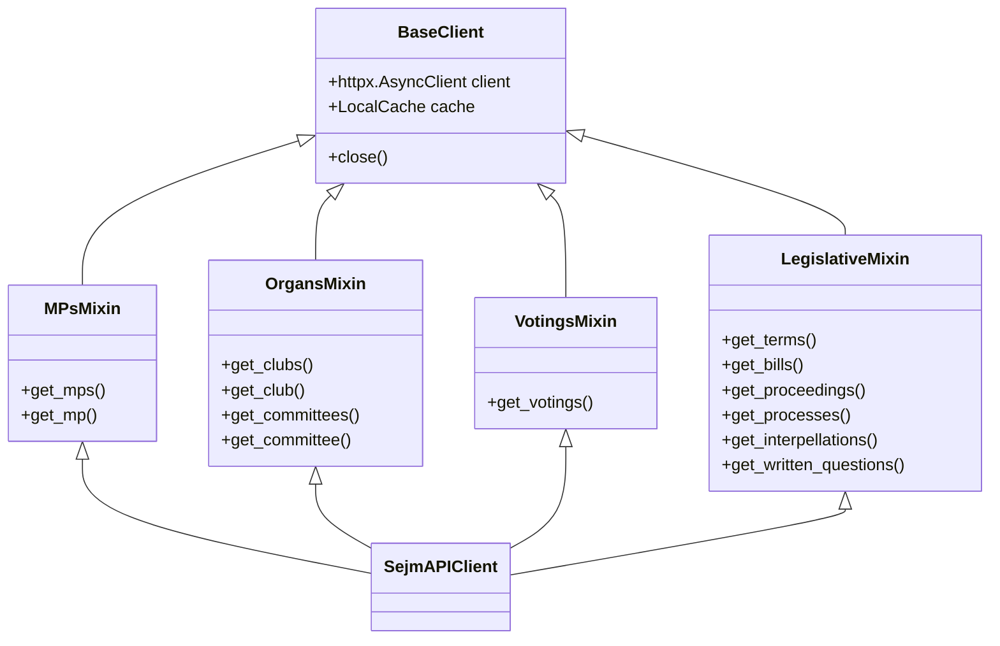

# Architektura Systemu CivicTechSejm

System CivicTechSejm jest skonteneryzowaną aplikacją webową zaprojektowaną do pobierania, analizowania, agregowania i prezentowania danych z Sejmu Rzeczypospolitej Polskiej.

---

## 1. Ogólny Schemat Architektury

Aplikacja składa się z trzech głównych komponentów uruchamianych w kontenerach Docker:

1.  **Frontend (React + Vite)**: Interfejs użytkownika prezentujący wyniki głosowań, statystyki posłów oraz analizę projektów ustaw.
2.  **Backend (FastAPI)**: Warstwa logiczna serwera obsługująca endpointy API dla frontendu, komunikację z bazą danych oraz procesy ETL pobierające dane z Sejmu.
3.  **Baza danych (PostgreSQL)**: Przechowuje przetworzone i zagregowane dane o posiedzeniach, dniach obrad, głosowaniach, wynikach klubów oraz posłów.

---

## 2. Architektura Integracji z API Sejmu

Komunikacja z zewnętrznym API Sejmu (`https://api.sejm.gov.pl`) jest zaimplementowana w module `sejm_client`. Wykorzystuje ona architekturę mixinów w celu zachowania wysokiej modularności i separacji odpowiedzialności:

### Kluczowe Mechanizmy Integracji:
*   **Asynchroniczność**: Klient API opiera się na bibliotece `httpx.AsyncClient` i wszystkie metody są nieblokujące (`async/await`), co zapewnia wysoką wydajność współbieżną.
*   **Pula Połączeń**: Pojedyncza, globalnie współdzielona instancja `SejmAPIClient` w aplikacji pozwala na reużywanie połączeń HTTP (connection pooling).
*   **Cechowanie (Caching)**: Lokalny mechanizm `LocalCache` zapisuje wyniki zapytań API z określonym czasem życia (TTL):
    *   Dane statyczne (kadencje, kluby, komisje): 24 godziny (86400s).
    *   Dane zmienne (głosowania, posłowie, projekty ustaw): 1 godzina (3600s).
*   **Ponawianie zapytań (Retry)**: Dekorator `@retry_with_backoff()` automatycznie ponawia zapytania w przypadku błędów sieciowych lub kodów statusu `429/5xx`, wykorzystując wykładnicze opóźnienie z losowym zakłóceniem (jitter).

---

## 3. Przepływ Procesu ETL (Import Głosowań)

Proces importowania i strukturyzacji danych o głosowaniach przebiega następująco:

1.  **Wyzwanie Importu**: Klient wywołuje endpoint `POST /api/votings/import?proceeding_id=X`.
2.  **Pobranie Danych Posiedzenia**: Serwis pobiera informacje o posiedzeniu `X`, aby określić jego oficjalny zakres dat.
3.  **Pobranie Wykazu Głosowań**: Pobierana jest lista wszystkich głosowań na tym posiedzeniu (nagłówki zawierające numery głosowań i daty).
4.  **Agregacja Szczegółów Głosowania**: Dla każdego głosowania:
    *   Pobierane są pełne wyniki wraz z imienną listą głosów wszystkich posłów.
    *   Weryfikowane jest, czy głosowanie przeszło (`passed`) na podstawie liczby głosów "Za" i wymaganego kworum/większości głosów.
    *   Głosy poszczególnych posłów są grupowane według przynależności klubowej (np. KO, PiS, Lewica itp.).
    *   Wyliczane są statystyki klubowe (turnout, frekwencja, dominujący głos).
5.  **Zapis Transakcyjny**: Dane są zapisywane w relacyjnej strukturze bazy danych w sposób idempotentny (ponowne wywołanie usuwa stare i zapisuje aktualne wersje rekordów bez powielania danych).
