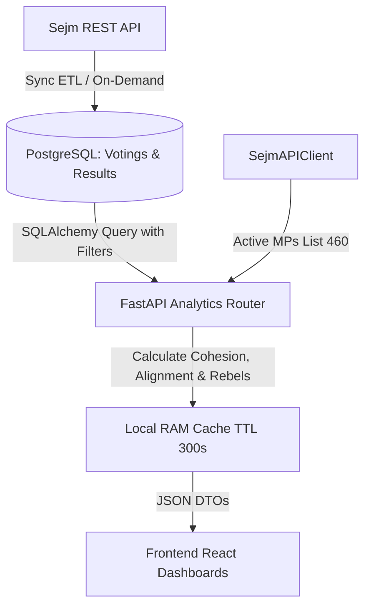

# Analityka Klubowa i Behawioralna Sejmu RP (`/api/clubs`)

Niniejszy dokument przedstawia szczegółową architekturę modułu analityki klubowej w systemie `CivicTechSejm`, wyjaśniając, **jakie dane są analizowane, w jaki sposób są wyliczane wskaźniki matematyczne i statystyczne** oraz jak interpretować uzyskane wyniki w kontekście politycznym i parlamentarnym.

---

## 1. Ogólny Zarys Modułu

Moduł analityki klubowej ma na celu przekształcenie surowych, jednostkowych danych o tysiącach głosowań parlamentarnych (pobieranych z oficjalnego API Sejmu `api.sejm.gov.pl`) w czytelne wskaźniki syntetyczne. Pozwalają one ocenić dyscyplinę partii, frekwencję, stabilność koalicji, poziom polaryzacji oraz zidentyfikować indywidualnych posłów wyłamujących się z linii klubowej ("buntowników").

Wszystkie obliczenia analityczne wykonywane są w warstwie **Backendu (FastAPI & SQLAlchemy)** na znormalizowanej bazie danych PostgreSQL, a ich wyniki są buforowane w pamięci podręcznej (`analytics_cache`), aby zapewnić natychmiastowy czas odpowiedzi aplikacji.

---

## 2. Kluczowe Wskaźniki i Metodyka Ich Wyliczania

### 2.1 Wskaźnik Dyscypliny / Spójności (Cohesion Score)
Wskaźnik kohezji określa stopień jednomyślności posłów danego klubu lub koła poselskiego podczas głosowania.

*   **Wzór dla pojedynczego głosowania**:
    Dla danego klubu $c$ w głosowaniu $v$, niech $Y$, $N$, $A$ oznaczają odpowiednio liczbę głosów "Za", "Przeciw" i "Wstrzymał się" oddanych przez posłów tego klubu (z wyłączeniem nieobecnych).
    
    $$\text{Kohezja}(c, v) = \frac{\max(Y, N, A)}{Y + N + A} \times 100\%$$

*   **Średnia Kohezja Klubu (Average Cohesion)**:
    Jest to średnia arytmetyczna wskaźnika kohezji z całego analizowanego zbioru głosowań $V$:
    
    $$\text{Średnia Kohezja}(c) = \frac{1}{|V|} \sum_{v \in V} \text{Kohezja}(c, v)$$

*   **Interpretacja**:
    *   **$100\%$**: Pełna dyscyplina partyjna – wszyscy głosujący członkowie klubu oddali identyczny głos.
    *   **$70\% - 99\%$**: Umiarkowana dyscyplina lub pojedyncze wyłamania / pomyłki poselskie.
    *   **$\approx 50\%$**: Głęboki podział w klubie (np. połowa głosuje "Za", połowa "Przeciw", co często występuje w głosowaniach światopoglądowych lub przy braku dyscypliny klubowej).

---

### 2.2 Wskaźnik Frekwencji Klubowej (Attendance Percent)
Określa aktywne uczestnictwo członków klubu w pracach Sejmu.

*   **Wzór**:
    Stosunek łącznej liczby oddanych głosów ($Y + N + A$) do całkowitej potencjalnej liczby głosów (liczba aktywnych posłów klubu $\times$ liczba głosowań):
    
    $$\text{Frekwencja}(c) = \frac{\sum_{v \in V} (Y_{c,v} + N_{c,v} + A_{c,v})}{|V| \times \text{Liczba Członków Klubu}}$$

---

### 2.3 Wskaźnik Wspierania Większości (Majority Support Percent)
Pokazuje, jak często dominujące stanowisko danego klubu pokrywa się z ostatecznym, wygranym wynikiem całego Sejmu.

*   **Metodyka**:
    Dla każdego głosowania wyznaczana jest **decyzja dominująca klubu** ($\text{Decyzja}_c \in \{\text{YES}, \text{NO}, \text{ABSTAIN}, \text{MIXED}\}$).
    Głosowanie uznaje się za "zgodne z większością Sejmu", jeśli:
    *   Klub zagłosował dominująco `YES`, a ustawa/uchwała została przyjęta (`passed == True`).
    *   Klub zagłosował dominująco `NO`, a projekt został odrzucony (`passed == False`).
*   **Zastosowanie**: Wskaźnik ten natychmiastowo rozróżnia kluby obozu rządzącego (wskaźnik zazwyczaj $> 90\%$) od klubów opozycyjnych (wskaźnik znacznie niższy, zależny od strategii opozycji).

---

## 3. Moduły i Funkcje Analityczne

### 3.1 Przegląd Klubów (`GET /api/clubs`)
*   **Co analizuje**: Zestawienie tabelaryczne i wykresy dla wszystkich aktywnych klubów w Sejmie.
*   **Wyliczane parametry**: Średnia frekwencja, średnia kohezja, wskaźnik wspierania większości oraz ogólny rozkład decyzji (`YES`, `NO`, `ABSTAIN`, `MIXED`).
*   **Filtry kontekstowe**: Użytkownik może zawęzić analizę do konkretnego przedziału dat, numeru posiedzenia, słowa kluczowego (np. "podatek", "budżet") lub minimalnego progu frekwencji.

---

### 3.2 Porównywarka Klubów i Konfrontacja Bezpośrednia (`GET /api/clubs/compare`)
*   **Co analizuje**: Bezpośrednie zestawienie 2 lub 3 wytypowanych klubów w tym samym zbiorze historycznych głosowań.
*   **Wskaźnik Zgodności (Alignment Percent)**:
    Procent wspólnie przebytych głosowań, w których porównywane kluby podjęły **identyczną decyzję dominującą**:
    
    $$\text{Zgodność}(A, B) = \frac{\text{Liczba głosowań gdzie } \text{Decyzja}_A == \text{Decyzja}_B}{\text{Liczba wspólnych głosowań}} \times 100\%$$
*   **Analiza Punktów Spornych**: System potrafi wyizolować wyłącznie te głosowania, w których doszło do rozbieżności stanowisk (np. Klub A głosował "Za", a Klub B "Przeciw"), co pozwala badaczom i dziennikarzom analizować osie sporu w koalicjach lub punkty wspólne między rządem a opozycją.

---

### 3.3 Macierz Zgodności NxN (`GET /api/clubs/matrix`)
*   **Co analizuje**: Pełna siatka relacji (Heatmapa) łącząca każdy aktywny klub z każdym innym w Sejmie.
*   **W jaki sposób**: Backend iteruje po wszystkich kombinacjach par klubów $(A, B)$ i dla przefiltrowanych głosowań wylicza procentową zgodność ich decyzji. Wyświetlana w formie kolorowej macierzy pozwala natychmiast zidentyfikować bloki polityczne, koalicje formalne i nieformalne oraz stopień polaryzacji parlamentu.

---

### 3.4 Wyszukiwarka Behawioralna (`GET /api/clubs/filter`)
*   **Co analizuje**: Zaawansowane wyszukiwanie głosowań na podstawie precyzyjnych wzorców zachowań klubowych.
*   **Dostępne kryteria behawioralne**:
    1.  **Filtrowanie po decyzji**: Znajdź wszystkie głosowania, gdzie konkretny klub zagłosował w określony sposób (np. Lewica zagłosowała `PRZECIW` lub `WSTRZYMAŁ SIĘ`).
    2.  **Filtrowanie po anomaliach dyscypliny (Kohezja)**: Umożliwia wyszukiwanie głosowań z niską kohezją (np. `max_cohesion <= 75%`). Jest to idealne narzędzie do wykrywania pęknięć wewnątrzpartyjnych, projektów kontrowersyjnych oraz ustaw głosowanych bez dyscypliny klubowej (tzw. głosowanie zgodnie z sumieniem).

---

### 3.5 Profil Klubu i Indeks Buntowników (`GET /api/clubs/{id}/stats`)
*   **Co analizuje**: Indywidualne zachowania posłów wewnątrz wybranego klubu.
*   **Indeks Buntowników (Rebel MPs Index)**:
    *   **Definicja "Buntu"**: Głos posła jest klasyfikowany jako błąd/bunt, gdy jego indywidualna decyzja (`YES`, `NO`, `ABSTAIN`) różni się od dominującej decyzji podjętej przez większość jego klubu w danym głosowaniu.
    *   **Metodyka wyliczania**:
        $$\text{Wskaźnik Buntu Posła} = \frac{\text{Liczba głosów wbrew linii klubu}}{\text{Liczba oddanych głosów posła}} \times 100\%$$
    *   System generuje ranking posłów najczęściej wyłamujących się z dyscypliny oraz udostępnia szczegółową listę konkretnych głosowań, w których nastąpiło wyłamanie (wraz z informacją, jak zagłosował poseł, a jak klub).
*   **Największe Absencje (Top Absentees)**:
    Ranking członków klubu o najniższej frekwencji (najwyższy odsetek statusu `Nie głosował` w historii obrad).
*   **Historia Kohezji i Frekwencji**: Agregacja trendów w czasie (krok po kroku dla kolejnych posiedzeń), pozwalająca ocenić, czy dyscyplina w klubie rośnie, czy maleje na przestrzeni kadencji.

---

## 4. Zaawansowana Filtracja i Warunki Brzegowe

Aby wyniki analityczne były rzetelne i odporne na zakłócenia wynikające ze specyfiki procedur parlamentarnych, wdrożono trzy kluczowe filtry globalne:

### 4.1 Weryfikacja Aktywnych Mandatów (`active_only=True`)
*   **Problem**: W trakcie trwania X kadencji Sejmu dochodzi do wygaszania mandatów (np. wybór do Europarlamentu, rezygnacje), rotacji oraz powstawania i rozwiązywania kół poselskich. Zsumowanie wszystkich rekordów z historii kadencji daje 559 posłów i 16 klubów/kół.
*   **Rozwiązanie**: Backend w locie komunikuje się z API Sejmu (`SejmAPIClient`), pobierając bieżącą listę posłów ze statusem `active == True`. 
*   **Efekt**: W domyślnym trybie analitycznym aplikacja bierze pod uwagę wyłącznie obecnie istniejące kluby i **dokładnie 460 aktualnych posłów**. Posłowie historyczni nie zniekształcają rankingów buntowników ani absencji. Przełącznik w interfejsie pozwala w dowolnej chwili wyłączyć ten filtr i zbadać pełną historię kadencji.

### 4.2 Filtr Głosowań Stykowych (`close_votings_only=True`)
*   **Cel**: Wyizolowanie najbardziej zaciętych i emocjonujących głosowań w Sejmie.
*   **Warunek algorytmiczny**: Głosowanie jest uznawane za stykowe, gdy różnica między obozem zwolenników a przeciwników wynosi mniej niż 15 głosów:
    
    $$|Y_{\text{total}} - N_{\text{total}}| < 15$$
*   **Zastosowanie**: Analiza kohezji i buntowników wyłącznie w głosowaniach stykowych pozwala ocenić, na ile stabilna jest większość rządowa w sytuacjach krytycznych, gdzie każdy pojedynczy głos decyduje o przyjęciu lub odrzuceniu ustawy.

### 4.3 Próg Minimalnej Frekwencji (`min_attendance`)
*   **Cel**: Eliminacja z analizy głosowań zbojkotowanych przez część obozów politycznych lub głosowań bez wymaganego kworum (231 posłów).
*   **Działanie**: Użytkownik za pomocą suwaka na frontendzie (np. ustawionego na 50%) wyklucza z obliczeń macierzy zgodności czy przeglądu klubów te głosowania, w których ogólna frekwencja Sejmu była niższa niż wskazany próg procentowy.

---

## 5. Podsumowanie Przepływu Danych w Analityce

Dzięki tak zaprojektowanej architekturze system zapewnia błyskawiczny dostęp do zaawansowanych statystyk politycznych, zachowując 100% spójności matematycznej i odwzorowując rzeczywisty stan obrad Sejmu RP.
